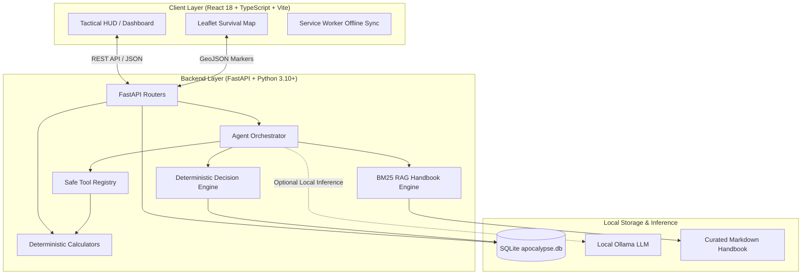

# ⚡ SurvivalOS

<div align="center">


**Offline-First Personal Survival Intelligence & Emergency Command Terminal**

*"Internet when available. Intelligence when unavailable."*

[](RELEASE_NOTES.md)
[](https://fastapi.tiangolo.com/)
[](https://reactjs.org/)
[](https://www.typescriptlang.org/)
[](https://vitejs.dev/)
[](https://tailwindcss.com/)
[](https://www.sqlite.org/)
[](https://leafletjs.com/)
[](https://ollama.com/)
[](docs/CLOUDFLARE_DEMO.md)
[](https://github.com/Shalokexe/SURVIVAL-OS-)
[](LICENSE)

[Features](#-core-features--modules) • [Architecture](#-system-architecture) • [Quick Start](#-quick-start) • [Cloudflare Demo](#-instant-live-demo-via-cloudflare) • [Tech Stack](#-technology-stack) • [Release Notes](RELEASE_NOTES.md)

---

</div>

## 🌐 Overview

**SurvivalOS** is a resilient, offline-first tactical command center engineered for scenarios where power grids fail, cellular networks collapse, and cloud dependencies vanish. Built with high-contrast tactical telemetry, deterministic mathematical engines, local AI language modeling (Ollama), and a curated offline emergency handbook, SurvivalOS transforms limited supplies and uncertain situations into clear, actionable, life-saving protocols.

Whether dealing with natural disasters, regional blackouts, remote off-grid expeditions, or emergency household readiness, SurvivalOS operates **100% locally on your machine** without transmitting a single byte of personal data to external servers.

---

## 🚀 Key Highlights

- ⚡ **Zero Cloud Dependency**: Operates entirely offline with SQLite storage and local assets.
- 🔋 **Apocalypse Minimal OS Mode**: 0-Lux deep black battery-saver mode designed for multi-day blackouts.
- 🤖 **Hybrid AI Copilot**: Uses local neural models (Ollama `qwen2.5` / `qwen3`) with instantaneous deterministic rule-engine fallback.
- 🩺 **START First-Aid Triage & CPR**: Rapid 60-second mass casualty flowchart and 110 BPM acoustic metronome.
- 📊 **Dynamic Preparedness Score**: Real-time 0–100 readiness audit based on essential survival categories.
- 💧 **Water IQ & Food IQ**: Mathematical supply runway calculators, caloric tracking, and rainwater catchment modeling.
- 🗺️ **Tactical Survival Map**: Offline-ready Leaflet GIS mapping with custom hazard markers, safe zones, and confidence decay.
- 📻 **Tactical Radio Frequency Deck**: Curated directory of NOAA, Marine, HAM, and FRS emergency channels + SOS audio synthesizer.
- 📚 **Curated Offline Handbook (RAG)**: Fast term-indexed retrieval for first aid, triage, purification, evacuation, and power.
- 🔒 **Absolute Privacy**: All medical records, ICE contacts, and inventory stay local to your device.

---

## 🎯 Core Features & Modules

```
 ┌────────────────────────────────────────────────────────────────────────┐
 │                              SURVIVAL-OS                               │
 │                TACTICAL EMERGENCY OPERATING SYSTEM                     │
 └───────┬────────────┬─────────────┬─────────────┬────────────┬──────────┘
         │            │             │             │            │
         ▼            ▼             ▼             ▼            ▼
   🛡️ COMMAND      🤖 TACTICAL    🗺️ SURVIVAL   💧 RESOURCE   ⚡ EMERGENCY
     CENTER         AI AGENT        MAP           CALCULATORS   VAULT
```

### 1. 🛡️ Command Center & Readiness HUD
- **Real-Time Preparedness Score (0–100)**: Dynamically weights water, food, medical supplies, power reserves, and tool readiness.
- **Immediate Action Radar**: Highlights critical urgent tasks based on disaster timeline (*First 15 min*, *First Hour*, *First 24 Hours*).
- **Supply Expiration Radar**: Proactively flags expired goods and items expiring within 30 days.
- **Operating Mode Ticker**: Displays local neural model availability, network state, and database telemetry.

### 2. 🤖 Hybrid AI Emergency Copilot
- **Structured Emergency Triage**: Delivers clear 4-part action protocols:
  1. **Situation Assessment**: Threat classification and severity analysis.
  2. **Immediate Actions ("Do This Now")**: Ordered, priority-ranked steps.
  3. **Critical Warnings ("Avoid Doing")**: High-risk hazards to avoid.
  4. **Handbook References**: Grounded citations from official survival manuals.
- **Dual-Engine Architecture**:
  - *Primary*: Local LLM via Ollama (`qwen2.5`, `qwen3`, `llama3`).
  - *Fallback*: Instant deterministic rule engine for zero-latency, offline execution without a GPU.

### 3. 🗺️ Tactical Survival Map (GIS)
- **Local Spatial Tracking**: Pinpoint crucial survival markers with interactive Leaflet map layers.
- **Marker Taxonomy**: `SHELTER`, `WATER`, `FOOD`, `MEDICAL`, `POWER`, `FUEL`, `HAZARD`, `CHECKPOINT`.
- **Status & Confidence Ratings**: Classifies locations as `SAFE`, `DANGER`, or `UNKNOWN` with confidence indicators (`CONFIRMED`, `RECENTLY_CHECKED`, `OLD_INFO`).
- **Offline Caching**: Built for OpenStreetMap caching and zero-network map viewing.

### 4. 💧 Water IQ & Purification Suite
- **Household Need Calculator**: Calculates required liters based on adults, children, elderly, pets, ambient temperature, and exertion.
- **Purification Protocol Engine**: Dosing guides for boiling, bleach/chlorination (5-6% sodium hypochlorite), iodine, SODIS (solar disinfection), and micro-filtration.
- **Rainwater Yield Simulator**: Calculates potential liters harvested based on roof square footage and rainfall depth.

### 5. 🥫 Food IQ & Caloric Runway
- **Calorie Runway Counter**: Computes exact days of food remaining based on total inventory kilocalories and household basal metabolic needs.
- **Macronutrient Tracking**: Monitors shelf-stable grains, legumes, canned proteins, and emergency rations.
- **Smart Resource Substitution**: Recommends safe culinary, nutritional, and medicinal alternatives when key ingredients are missing.

### 6. 📦 Inventory Matrix & Deficit Alarms
- **Categorized Inventory**: Water, Food, Medical, Power, Tools, Sanitation, Defense, Shelter.
- **Location Storage Tracker**: Pinpoint which room, bin, shelf, or bug-out bag stores each item.
- **Category Deficit Alerts**: Alerts when any of the 6 core survival categories drop below baseline thresholds.

### 7. ⚡ Emergency Vault & ICE Deck
- **Offline Medical Profiles**: Securely stores blood types, chronic medical conditions, allergy alerts, and prescription backups.
- **ICE Contact Directory**: One-touch access to family rally contacts, emergency services (108/911/112), and local doctors.
- **Evacuation Checklist**: High-priority pack list for rapid bug-out scenarios.

### 8. 📖 Curated Offline Survival Handbook (RAG)
- Bundled Markdown knowledge repository indexed locally:
  - 🩹 `first_aid_triage.md` — Bleeding control, shock management, burn treatment, CPR protocols.
  - 💧 `water_purification.md` — Multi-stage filtration, chemical disinfection, storage sanitation.
  - 🏃 `disaster_evacuation.md` — Route planning, go-bag preparation, shelter-in-place criteria.
  - 🌾 `food_storage.md` — Long-term preservation, pest prevention, ration balancing.
  - 🔋 `power_lighting.md` — Solar battery management, blackout lighting, alternator charging.
  - 📻 `emergency_radio_comms.md` — Universal distress frequencies, band protocols, and power rules.
  - 🩺 `start_triage_cpr.md` — START mass casualty triage algorithm and 110 BPM CPR standard.

### 9. 📻 Tactical Radio Frequency Deck & Audio SOS Beacon
- **Universal Comms Reference**: Rapid frequency matrices for NOAA Weather (WX1–WX7), Marine VHF Ch 16, HAM 2m/70cm Simplex, FRS/GMRS, CB Ch 9/19, and Aviation Distress (121.500 MHz).
- **Web Audio 800Hz SOS Synthesizer**: Transmits clean international Morse Code distress audio (`... --- ...`) directly through device speakers.
- **NATO Phonetic Alphabet**: Quick-reference decoder for spelling coordinates through RF static.

### 10. 🔋 Apocalypse Minimal OS Mode (OLED Ultra-Battery Saver)
- **Deep Black Low-Power UI (`#000000`)**: Designed for multi-day blackouts to eliminate screen power draw on OLED/AMOLED screens.
- **Custom Pinned Survival Apps**: Select and pin only your most critical survival widgets to a clean, high-contrast launcher.
- **Live Battery Telemetry**: Real-time battery percentage, charging state, and estimated runtime via `navigator.getBattery()`.
- **Emergency Tool Strip**: Instant one-tap access to an emergency White Screen Flashlight and audio distress beacon.

### 11. 🩺 START First-Aid Triage & 110 BPM CPR Metronome
- **60-Second START Flowchart**: Step-by-step triage evaluating ambulation, respiration rate, perfusion, and mental status.
- **110 BPM Acoustic CPR Metronome**: Web Audio API rhythm pulses keeping correct compression cadence with visual 30:2 breath prompts.

---

## 🏗️ System Architecture



---

## 💻 Technology Stack

| Layer | Technology | Purpose |
| :--- | :--- | :--- |
| **Frontend UI** | React 18, TypeScript, Vite | Ultra-fast, reactive single-page dashboard |
| **Styling** | Tailwind CSS, Lucide Icons | High-contrast dark cyberpunk/tactical HUD |
| **Mapping** | Leaflet, React-Leaflet, OpenStreetMap | Offline-first interactive geographic markers |
| **Backend API** | FastAPI, Uvicorn, Pydantic v2 | High-throughput async REST API |
| **ORM & Database** | SQLAlchemy, SQLite | Zero-config embedded local database |
| **AI Orchestration** | Custom Agent Orchestrator | Context assembly, scenario detection, safety boundaries |
| **Local LLM** | Ollama (`qwen2.5`, `qwen3`, `llama3`) | Zero-cloud, on-device natural language reasoning |
| **Fallback Engine** | Custom Deterministic Rule Engine | Guarantees instant responses even if LLM is offline |
| **Knowledge (RAG)** | Local BM25 / Term-Frequency Parser | Curated survival handbook search engine |

---

## ⚡ Quick Start

### 📋 Prerequisites

Ensure you have the following installed on your machine:
- **Python 3.10+**
- **Node.js 18+** and **npm**
- *(Optional for AI Features)* [Ollama](https://ollama.com/)

---

### 📥 1. Clone the Repository

```bash
git clone https://github.com/Shalokexe/SURVIVAL-OS-.git
cd SURVIVAL-OS-
```

---

### 📦 2. Install Dependencies

#### Backend
```bash
cd backend
python -m pip install -r requirements.txt
# Or install directly:
python -m pip install fastapi uvicorn sqlalchemy pydantic jinja2
```

#### Frontend
```bash
cd ../frontend
npm install
```

---

### 🚀 3. Run with Unified Launcher (Single Command)

From the root directory:

```bash
python run_dev.py
```

This concurrently boots:
- 🟢 **Frontend UI**: [http://localhost:5173](http://localhost:5173)
- 🟢 **FastAPI Backend**: [http://127.0.0.1:8000](http://127.0.0.1:8000)
- 📖 **Interactive API Docs (Swagger)**: [http://127.0.0.1:8000/docs](http://127.0.0.1:8000/docs)

---

### 🤖 4. (Optional) Enable Local Neural AI with Ollama

To enable local AI reasoning:

1. Download and start [Ollama](https://ollama.com/).
2. Pull your preferred survival model:
   ```bash
   ollama run qwen2.5:latest
   # or
   ollama run qwen3
   ```
3. SurvivalOS will automatically detect Ollama running at `http://localhost:11434` and switch from the rule engine to neural inference!

---

### ☁️ 5. Instant Live Demo via Cloudflare (Quick Tunnel)

To instantly share a live demo with anyone over the internet (or open it on your phone) with a secure, zero-config HTTPS URL:

```bash
python run_cloudflare_demo.py
```

This launches the backend, frontend, and an instant Cloudflare Quick Tunnel (`https://xxxx.trycloudflare.com`). Read the full guide in [docs/CLOUDFLARE_DEMO.md](docs/CLOUDFLARE_DEMO.md).

---

## 📂 Repository Structure

```text
SurvivalOS/
├── backend/
│   ├── routers/               # Modular REST API endpoints
│   │   ├── agent.py           # AI prompt triage and execution
│   │   ├── emergency.py       # Contacts and vault endpoints
│   │   ├── inventory.py       # Supply catalog and food/water calculators
│   │   ├── knowledge.py       # Offline handbook search
│   │   ├── maps.py            # Spatial markers and geolocation
│   │   ├── system.py          # Health status and preparedness score
│   │   └── tasks.py           # Task timeline manager
│   ├── agent_orchestrator.py  # Context synthesis & LLM/Rule routing
│   ├── calculators.py         # Water IQ, Food IQ, and score math
│   ├── database.py            # SQLite engine configuration
│   ├── decision_engine.py     # Deterministic emergency fallback rules
│   ├── llm_provider.py        # Ollama local connector
│   ├── main.py                # FastAPI entrypoint and startup seeder
│   ├── models.py              # SQLAlchemy database models
│   ├── rag_engine.py          # Handbook text indexing and search
│   ├── schemas.py             # Pydantic data validation schemas
│   └── tool_registry.py       # Safe deterministic tool caller
├── data/
│   └── apocalypse.db          # Local SQLite storage (auto-seeded)
├── docs/                      # Technical specifications
│   ├── ARCHITECTURE.md        # Detailed subsystem diagrams
│   ├── AI_AGENT.md            # Agent prompt engineering and fallback design
│   ├── MAPS.md                # GIS and offline tile caching specs
│   ├── OFFLINE_MODE.md        # Service worker and sync queue specs
│   ├── SECURITY.md            # Privacy and data isolation model
│   └── UI_UX_ENHANCEMENTS.md  # Tactical HUD design system guide
├── frontend/
│   ├── src/
│   │   ├── components/        # Tactical UI views
│   │   │   ├── AIAgentView.tsx        # Emergency Copilot console
│   │   │   ├── CommandCenter.tsx      # Central triage HUD
│   │   │   ├── EmergencyVault.tsx     # Medical profiles & ICE contacts
│   │   │   ├── FoodIQ.tsx             # Calorie runway & substitutes
│   │   │   ├── InventoryManager.tsx   # Supply catalog & deficit alerts
│   │   │   ├── PreparednessScore.tsx  # Readiness metric breakdown
│   │   │   ├── PrepareWizard.tsx      # Step-by-step setup wizard
│   │   │   ├── SurvivalHandbook.tsx   # Offline knowledge reader
│   │   │   ├── SurvivalMap.tsx        # Leaflet tactical map
│   │   │   ├── TaskBoard.tsx          # Action timeline manager
│   │   │   └── WaterIQ.tsx            # Water quota & purification calculator
│   │   ├── types/             # TypeScript data contracts
│   │   ├── App.tsx            # Main shell with offline listeners
│   │   └── index.css          # Tailwind and tactical glow animations
│   ├── package.json
│   └── vite.config.ts
├── knowledge/
│   └── curated_handbook/      # Bundled offline markdown guides
├── run_dev.py                 # Cross-platform development launcher
└── README.md                  # Project documentation
```

---

## 📡 API Reference

| Method | Endpoint | Description |
| :--- | :--- | :--- |
| `GET` | `/api/system/status` | System health, model provider status, and score summary |
| `GET` | `/api/system/preparedness_score` | Detailed preparedness audit and category breakdown |
| `POST` | `/api/agent/query` | Submit emergency prompt to AI/Rule orchestrator |
| `GET` | `/api/inventory/items` | List all tracked supplies |
| `POST` | `/api/inventory/items` | Add new supply item to local inventory |
| `GET` | `/api/inventory/water_iq` | Calculate household water consumption targets |
| `GET` | `/api/inventory/food_iq` | Calculate caloric runway and days of sustenance |
| `GET` | `/api/maps/markers` | Retrieve tactical map markers |
| `POST` | `/api/maps/markers` | Add safe zone, hazard, water point, or shelter |
| `GET` | `/api/tasks/list` | Retrieve time-phased action tasks |
| `POST` | `/api/tasks/{task_id}/toggle` | Mark action task as completed/pending |
| `GET` | `/api/emergency/contacts` | List ICE contacts and emergency authorities |
| `GET` | `/api/knowledge/search?q={query}` | Query offline handbook with BM25 keyword matching |

---

## 🛡️ Security, Privacy & Reliability Guarantees

- 🔒 **Zero Telemetry**: No third-party trackers, external fonts, or remote analytics.
- 💾 **100% Local Data Ownership**: Your medical data, household numbers, coordinates, and supplies remain strictly in your local `data/apocalypse.db` file.
- 🛡️ **Sandboxed AI Execution**: The AI Agent interacts only with predetermined, read-only calculation tools. It cannot execute arbitrary system commands or compromise device safety.
- ⚡ **Fail-Safe Determinism**: If the AI model runs out of VRAM or crashes, the system seamlessly continues running on pure deterministic logic.

---

## 🗺️ Roadmap

- [x] **Phase 1**: Tactical HUD theme, telemetry metrics, and core calculators.
- [x] **Phase 2**: Dual-engine AI triage (Ollama + Deterministic fallback).
- [x] **Phase 3**: Offline Leaflet map with custom marker confidence decay.
- [x] **Phase 4**: Curated offline RAG handbook for survival knowledge.
- [ ] **Phase 5**: OLED Ultra-Battery Saver Mode (0-lux black background for emergency battery preservation).
- [ ] **Phase 6**: LoRa / Meshtastic packet radio bridging for localized off-grid text mesh communication.
- [ ] **Phase 7**: One-Click Printable Emergency Bug-Out Cards (Physical paper backup).

---

## 🤝 Contributing

Contributions that bolster offline reliability, accessibility, medical verification, and emergency readiness are warmly welcomed!

1. Fork the Project (`https://github.com/Shalokexe/SURVIVAL-OS-`)
2. Create your Feature Branch (`git checkout -b feature/TacticalFeature`)
3. Commit your Changes (`git commit -m 'feat: Add Tactical Feature'`)
4. Push to the Branch (`git push origin feature/TacticalFeature`)
5. Open a Pull Request

---

## 👤 Author

**Shalok**
- GitHub: [@Shalokexe](https://github.com/Shalokexe)
- Repository: [SURVIVAL-OS-](https://github.com/Shalokexe/SURVIVAL-OS-)

---

## 📄 License

This project is licensed under the MIT License - see the [LICENSE](LICENSE) file for details.

---

<div align="center">
  <sub>Built for resilience. Prepared for anything. 🛡️</sub>
</div>
