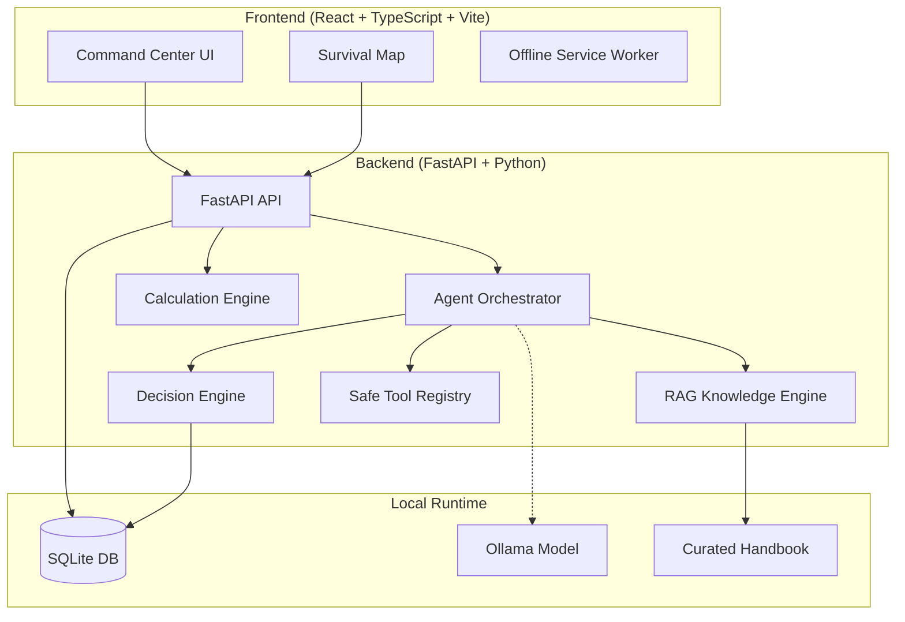

# SurvivalOS

<div align="center">


**Offline-first personal survival intelligence & emergency command terminal**

> "Internet when available. Intelligence when unavailable."

[](RELEASE_NOTES.md)
[](https://fastapi.tiangolo.com/)
[](https://reactjs.org/)
[](https://www.typescriptlang.org/)
[](https://vitejs.dev/)
[](https://www.sqlite.org/)
[](https://ollama.com/)
[](docs/CLOUDFLARE_DEMO.md)
[](https://github.com/Shalokexe/SURVIVAL-OS-)
[](LICENSE)

[Overview](#overview) • [Features](#core-features) • [Architecture](#system-architecture) • [Quick Start](#quick-start) • [Project Structure](#project-structure) • [Roadmap](#roadmap)

</div>

```text
  ┌────────────────────────────────────────────────────────────────────────┐
  │  ⚡ SURVIVAL-OS // DOOMSDAY CHRONICLES & DAILY VLOG HUD  [v1.0.0-BETA.5] │
  ├────────────────────────────────────────────────────────────────────────┤
  │  [REC ● 00:42]  RAD: 0.12 μSv/h | BATT: 94% ⚡ | GRID: 31.326°N 75.576°E │
  ├────────────────────────────────────────────────────────────────────────┤
  │  ┌──────────────────────────────────────────────┐  ┌─────────────────┐  │
  │  │  🎥 TACTICAL WEBCAM VLOG STUDIO (CRT ON)     │  │ 🏆 SURVIVOR EXP │  │
  │  │  ┌────────────────────────────────────────┐  │  │ STREAK: 14 DAYS │  │
  │  │  │ +------------------------------------+ │  │  │ BONUS : +25%    │  │
  │  │  │ | [LIVE STREAM] DAY 14 VLOG RECORDING    | │  │  ├────────────────┤  │
  │  │  │ | > WATER PURIFICATION DISINFECTION  | │  │  │ UNLOCKED BADGES │  │
  │  │  │ | > CPR & WOUND TRIAGE DRILL PASSED  | │  │  │  [★] LONE VLOG  │  │
  │  │  │ +------------------------------------+ │  │  │  [★] FIELD MEDIC│  │
  │  │  └────────────────────────────────────────┘  │  │  [★] RADIO RECON│  │
  │  └──────────────────────────────────────────────┘  └─────────────────┘  │
  ├────────────────────────────────────────────────────────────────────────┤
  │  🤖 AI COMMAND TACTICAL DEBRIEF: "Outstanding speed securing reserves"  │
  └────────────────────────────────────────────────────────────────────────┘
```

---

## Overview

SurvivalOS is a resilient, offline-first emergency command center built to help people act decisively when communications, power, and cloud infrastructure fail. It combines a tactical dashboard, deterministic emergency calculators, offline knowledge retrieval, and optional local AI inference to turn uncertainty into structured action.

The project is designed for natural disasters, blackouts, remote field use, household readiness, and emergency planning. It runs locally without sending personal data to external services, making it useful in low-connectivity or no-connectivity environments.

---

## Core Features

- 🌿 **Wild Flora & Photo Edibility Scanner**: Live camera plant snapshot scanner, 8-stage Universal Edibility Test (UET) wizard, and toxic plant red-flag checklist
- 🌐 **Offline Mesh Emergency Comms**: Client-side P2P BroadcastChannel relay network for offline survivor-to-survivor messaging and SOS beacons
- ⚖️ **Wasteland Barter Matrix**: Post-collapse currency-free supply trade value calculator with deal fairness evaluation
- ☣️ **Atmospheric Fallout & Wet-Bulb Physics**: 7-10 Fallout radiation decay calculator and hyperthermia exposure index
- 🚨 **Perimeter Defense Radar & Motion Tripwire**: WebCam frame-difference & decibel noise sensor tripwire with siren alerts for shelter security
- 📡 **Optical Morse Code Beacon & Signal Strobe**: Text-to-Morse optical generator, torch pulses, and audio pulse synthesizer for rescue signaling
- 📹 **Doomsday Chronicles & Daily Vlogs**: WebCam video studio with CRT/Night Vision HUD, voice recorder & survival module mastery tracker
- ⚡ **Zero-cloud operation** with local IndexedDB/LocalStorage persistence


- 🔋 **Apocalypse Minimal OS mode** for low-power, blackout-friendly UI
- 🤖 **Hybrid AI emergency copilot** with Ollama + deterministic fallback
- 🩺 **START triage workflow** and CPR metronome
- 📊 **Preparedness score tracking** across food, water, medical, power, and shelter
- 💧 **Water and food runway calculators**
- 🗺️ **Offline survival map** with custom hazard, shelter, and resource markers
- 📻 **Radio frequency deck** and SOS audio beacon
- 📚 **Curated offline survival handbook** with fast local retrieval
- 🔒 **Privacy-focused local-first design** for medical and contact data


---

## Feature Modules

### 1. Command Center & Readiness HUD

- Real-time preparedness score from 0 to 100
- Urgent action radar for the first 15 minutes, 1 hour, and 24 hours
- Expiration warnings and supply deficiency tracking
- Local operating state display for AI, database, and connectivity

### 2. Hybrid AI Emergency Copilot

- Context-aware emergency triage
- Structured responses with assessment, immediate actions, warnings, and bibliography
- Primary local AI path using Ollama models
- Deterministic fallback engine when LLM access is unavailable

### 3. Tactical Survival Map

- Leaflet-based offline map interactions
- Marker categories for shelter, water, food, medical, power, fuel, hazard, and checkpoints
- Confidence and status labeling for each discovery
- Built for local and low-network use

### 4. Water IQ & Purification

- Household water requirement calculations
- Boiling, bleach, iodine, SODIS, and filter-based guidance
- Rainwater harvesting estimates based on roof area and precipitation

### 5. Food IQ & Caloric Planning

- Inventory calorie tracking
- Days of food remaining calculations
- Resource substitution and ration planning support

### 6. Inventory Matrix & Vault

- Room-by-room and bin-by-bin organization
- Medical profile and ICE contact storage
- Bug-out checklist and emergency contact access

### 7. Offline Knowledge Base

Bundled survival manuals include:

- first_aid_triage.md
- water_purification.md
- disaster_evacuation.md
- food_storage.md
- power_lighting.md
- emergency_radio_comms.md
- start_triage_cpr.md

### 8. Doomsday Chronicles & Daily Vlogs

- **Live WebCam Studio**: Video vlog recorder with CRT scanline filters, HUD coordinate stamps, and Night Vision toggle
- **Hands-Free Audio Recorder**: Voice note memos for low-battery or blackout scenarios
- **Survival Module Reflection**: Tag daily learnings (*Water IQ, CPR Triage, Solar Power, Radio Comms*) with AI debriefing
- **Doomsday Timeline & Badges**: Day-by-day survival streak tracker and unlockable milestone trophies

### 9. Shelter Perimeter Defense Radar

- **Motion Variance Tripwire**: Real-time WebCam frame-difference calculation to detect entry while sleeping
- **Decibel Spike Detector**: Audio level analyser for glass breaking or footsteps
- **Radar Target Display & Siren Alert**: Visual radar sweeper HUD with intrusion log and audible siren alarms

### 10. Optical Morse Beacon & Rescue Strobe

- **Text-to-Morse Optical Flasher**: Converts any emergency message (e.g., `SOS TRAPPED FLAT 4B`) into Morse light bursts
- **Hardware Torch & Audio Beeper**: Synchronizes screen color pulses, camera flashlight torch, and 750Hz audio tones
- **Manual Telegraph Key**: Touch/click telegraph pad for sending custom manual Morse code

### 11. Wasteland Barter & Atmospheric Physics

- **Post-Collapse Barter Matrix**: Evaluates trade fairness values for survival goods without currency
- **Nuclear Fallout 7-10 Decay Rule**: Calculates radiation decay over time ($R_t = R_1 \cdot t^{-1.2}$) and safe exit times
- **Wet-Bulb Exposure Index**: Calculates hyperthermia and frostbite risks based on temperature and humidity

### 12. Offline Mesh Emergency Comms

- **P2P Local Relay Network**: Cross-window/tab message propagation using HTML5 `BroadcastChannel` APIs without servers
- **SOS Emergency Broadcast**: One-tap distress beacon dispatch with GPS coordinates and supply requests
- **Node Topology Visualizer**: Displays connected survivor relay nodes, signal RSSI (dBm), and multi-hop relay distances


---

## System Architecture



---

## Technology Stack

| Layer | Stack | Purpose |
| :--- | :--- | :--- |
| Frontend | React 18, TypeScript, Vite | Interactive emergency dashboard |
| Styling | Tailwind CSS | High-contrast tactical UI |
| Mapping | Leaflet, OpenStreetMap | Offline spatial overlays |
| Backend | FastAPI, Uvicorn, Pydantic | Fast API services |
| Storage | SQLAlchemy, SQLite | Local embedded data layer |
| AI | Ollama + custom orchestration | Local AI reasoning |
| Fallback | Deterministic rule engine | Safe offline response path |
| Knowledge | Local handbook index | Fast emergency lookup |

---

## Quick Start

### Prerequisites

- Python 3.10+
- Node.js 18+
- npm
- Optional: [Ollama](https://ollama.com/)

### 1. Clone the repository

```bash
git clone https://github.com/Shalokexe/SURVIVAL-OS-.git
cd SURVIVAL-OS-
```

### 2. Install backend dependencies

```bash
cd backend
python -m pip install -r requirements.txt
```

### 3. Install frontend dependencies

```bash
cd ../frontend
npm install
```

### 4. Run the app

From the project root:

```bash
python run_dev.py
```

The app starts:

- Frontend: http://localhost:5173
- Backend: http://127.0.0.1:8000
- API Docs: http://127.0.0.1:8000/docs

### 5. Optional local AI setup

1. Install and start Ollama.
2. Pull a model:

```bash
ollama run qwen2.5:latest
```

3. SurvivalOS will detect it automatically at localhost:11434.

### 6. Cloudflare demo

```bash
python run_cloudflare_demo.py
```

This launches a secure demo tunnel for quick sharing.

---

## Project Structure

```text
SURVIVAL-OS-/
├── backend/
│   ├── routers/
│   ├── agent_orchestrator.py
│   ├── calculators.py
│   ├── database.py
│   ├── decision_engine.py
│   ├── llm_provider.py
│   ├── main.py
│   ├── models.py
│   ├── rag_engine.py
│   ├── schemas.py
│   └── tool_registry.py
├── data/
│   └── apocalypse.db
├── docs/
│   ├── AI_AGENT.md
│   ├── ARCHITECTURE.md
│   ├── CLOUDFLARE_DEMO.md
│   ├── MAPS.md
│   ├── OFFLINE_MODE.md
│   ├── SECURITY.md
│   └── UI_UX_ENHANCEMENTS.md
├── frontend/
│   ├── public/
│   ├── src/
│   ├── package.json
│   ├── vite.config.ts
│   └── tailwind.config.js
├── knowledge/
│   └── curated_handbook/
├── CHANGELOG.md
├── CONTRIBUTING.md
├── LICENSE
├── README.md
├── RELEASE_NOTES.md
├── run_cloudflare_demo.py
├── run_dev.py
└── .gitignore
```

---

## API Overview

| Method | Endpoint | Description |
| :--- | :--- | :--- |
| GET | /api/system/status | System health and score summary |
| GET | /api/system/preparedness_score | Detailed readiness audit |
| POST | /api/agent/query | Send an emergency query |
| GET | /api/inventory/items | List inventory |
| POST | /api/inventory/items | Add inventory item |
| GET | /api/inventory/water_iq | Water planning calculator |
| GET | /api/inventory/food_iq | Food runway calculator |
| GET | /api/maps/markers | Retrieve map markers |
| POST | /api/maps/markers | Add a new survivor marker |
| GET | /api/tasks/list | Fetch task list |
| POST | /api/tasks/{task_id}/toggle | Update task status |
| GET | /api/emergency/contacts | Show emergency contacts |
| GET | /api/knowledge/search?q={query} | Search local handbook |

---

## Privacy & Reliability

- 🔒 No third-party trackers or analytics
- 💾 Data remains on-device in SQLite
- 🛡️ AI tool use is restricted to safe operation boundaries
- ⚡ Deterministic fallback ensures the app keeps working even when AI fails

---

## Roadmap

- [x] Tactical emergency dashboard
- [x] Hybrid AI + fallback engine
- [x] Offline survival map
- [x] Curated offline knowledge database
- [ ] Battery saver / blackout UI mode
- [ ] Mesh radio integration
- [ ] Printable bug-out emergency cards

---

## Contributing

Contributions are welcome from developers, emergency planners, and survivalists who care about offline-first reliability and practical readiness.

1. Fork the repository
2. Create a feature branch
3. Commit your changes
4. Push to your branch
5. Open a pull request

---

## Author

**Shalok**

- GitHub: [@Shalokexe](https://github.com/Shalokexe)
- Repository: [SURVIVAL-OS-](https://github.com/Shalokexe/SURVIVAL-OS-)

---

## License

This project is licensed under the MIT License. See [LICENSE](LICENSE) for more details.

---

<div align="center">
  <sub>Built for resilience. Prepared for anything. 🛡️</sub>
</div>
