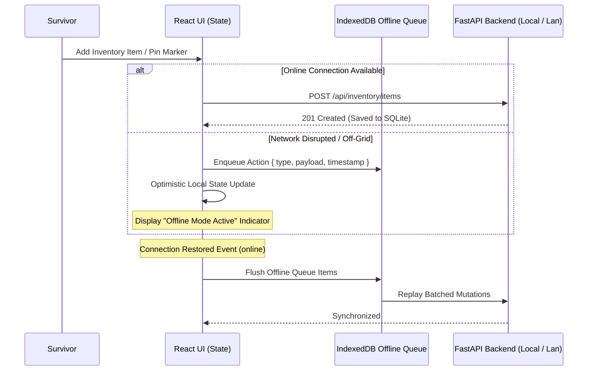

# 🔌 Offline-First Architecture & Synchronization

## 1. Zero-Cloud Resilience Philosophy

In genuine survival scenarios, access to remote cloud infrastructure, DNS resolvers, and content delivery networks (CDNs) cannot be assumed.

**SurvivalOS** implements an **Offline-First Storage & Service Model**:
- **Application Bundle**: All JavaScript, CSS, HTML, and vector icons are bundled into local static assets via Vite.
- **Embedded Database**: Local SQLite (`data/apocalypse.db`) acts as the single source of truth on the machine.
- **Local RAG Documents**: All survival handbooks and medical references are stored as local Markdown files on the host filesystem.

---

## 2. Client-Side Offline Detection & Replay Queue

The frontend UI actively listens to browser connection state:

---

## 3. Storage Hierarchy

| Layer | Technology | Lifetime | Purpose |
| :--- | :--- | :--- | :--- |
| **Volatile State** | React `useState` / Memory | Session | Transient UI state, search filters, zoom level |
| **Offline Cache** | Service Worker CacheStorage | Permanent | Static JavaScript, CSS, SVG icons, fonts |
| **Action Queue** | IndexedDB / LocalStorage | Persistent | Queued mutations while disconnected from local API |
| **Core Storage** | SQLite (`apocalypse.db`) | Permanent | Inventories, markers, medical vault, tasks, settings |
| **Knowledge Base** | Local Markdown Files | Permanent | Section-indexed emergency reference handbooks |

---

## 4. Map Tile Caching Strategy

1. **Online Phase**: When network is present, OpenStreetMap raster/vector tiles requested by Leaflet are cached in the browser's persistent cache.
2. **Offline Phase**: Previously viewed areas remain interactively pan-and-zoomable.
3. **Marker Independence**: All custom markers, safe zones, hazards, and user coordinates are stored in SQLite/local state and render cleanly regardless of tile availability.
